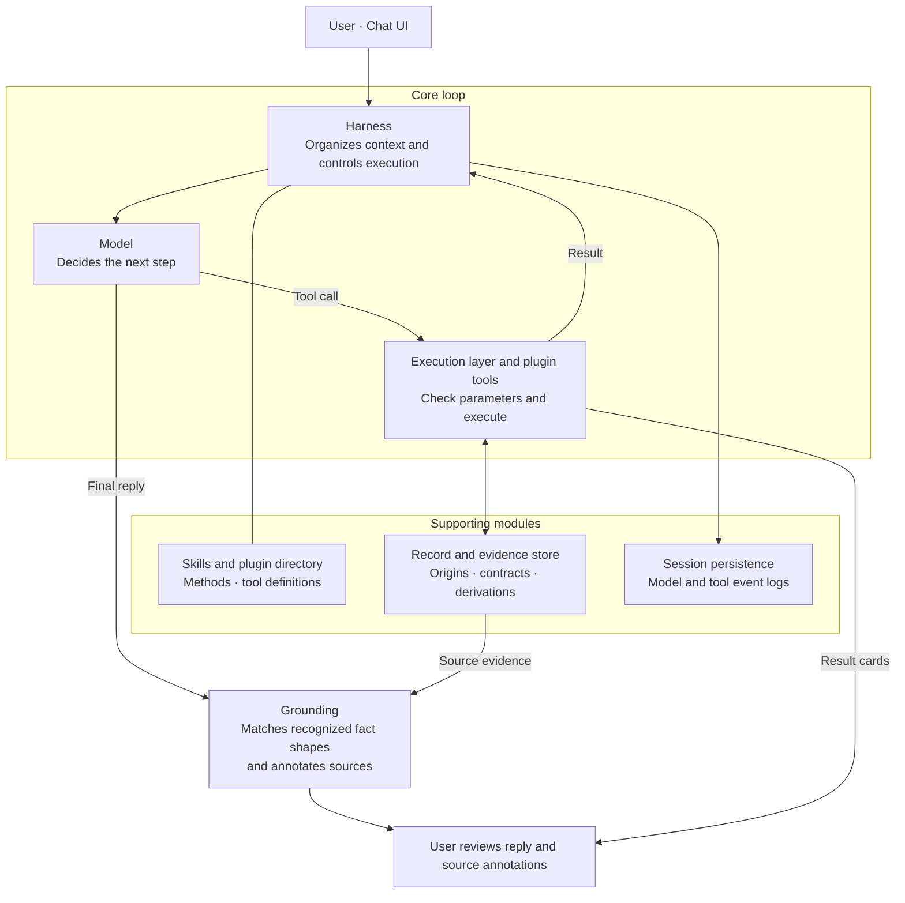

# Cite Counsel Harness

An experimental agent harness for legal work: bringing materials, model judgment, tool calls and source provenance into one reviewable workflow.

Legal research asks more than whether an assistant can produce a fluent answer. It needs to identify the right authority, read the relevant passage, distinguish supplied facts from retrieved evidence, and show what still needs checking. Cite Counsel gives the model a shared execution loop and a session evidence store for doing that work. The model chooses how to investigate and draft; the harness checks tool access, parameters and provenance, and retains the exchanges behind the answer.

The design treats source identity, document context and reviewability as engineering requirements. Legal relevance still requires judgment about jurisdiction, version, authority and the use of a passage in context. The harness preserves material and its origins so those decisions can be inspected; it does not automate their correctness.

> Experimental research aid. Review the original sources, the applicable law and the official McGill Guide before relying on an output. Grounding means traceability here; it does not establish legal correctness.

## Harness architecture



The arrows summarize responsibilities: the model requests actions, and the harness checks access and parameters before executing them. Tool results return to the shared loop; the harness receives final reply text and applies grounding before display. Structured result cards reach the UI through the local API.

The model reads an optional Markdown Skill for a method, loads an enabled plugin to expose its tool schemas, and chooses tool calls or a reply. Skills and tools are independent: reading a method does not execute a tool. Enabling a plugin makes it available for selection; it does not run automatically.

The harness validates calls and stores results by reference (`rec_N`, `art_N`, and findings). Tools receive stored objects rather than relying on the model to repeat their metadata. Tool summaries enter the conversation; structured blocks become UI cards. The model can continue investigating after a tool produces an artifact.

McGill formatting is deterministic code using local templates; quotation comparison, bibliography assembly and date arithmetic are also tool operations. Source verification is computed from stored derivations separately from formatting.

This separation reflects a practical legal workflow: retrieve and inspect the material, use code for repeatable operations, and leave interpretation and the decision to rely on an authority open to review.

### Execution and extension contracts

The streamed and non-streamed interfaces use the same turn generator. `Result.content` returns references and summaries to model history, while `Result.blocks` carries UI output. A turn permits at most 20 counted tool rounds; plugin-loading-only rounds are excluded from that count, with total iterations still bounded. Producing an artifact does not force the model to stop investigating.

Each plugin tool declares a Pydantic parameter model and a `handler(ctx, params) -> Result`. `Context` supplies session-scoped records, plugin state and settings. `ctx.records.get(ref)` reads a stored object; `ctx.save(obj, meta)` checks the plugin category and audits derivations before storing it. Category violations or malformed derivations raise `ContractError`; an unsupported provenance claim in a derivation is downgraded to `model` rather than retained as verified.

| Plugin category | Stored output contract | Implemented examples |
| --- | --- | --- |
| `source` | Records with database-origin fields; source identity is required for database verification | A2AJ, LEGISinfo, Crossref, Open Library |
| `extract` | Records with extracted-origin fields | File and web extraction |
| `function` | Artifacts and Findings with audited derivation chains | McGill, quotation checks, bibliography, deadlines |

The contract vocabulary is explicit: `Field` carries a value and origin; `Record` identifies a source and its fields; `Artifact` and `Finding` retain a `Derivation` of their inputs. `record__read(ref, field, offset, limit)` exposes at most 4,000 characters per call so the model can inspect longer material in slices.

### What the checks mean

| Check | Implemented meaning | What it does not establish |
| --- | --- | --- |
| Database provenance | A source plugin supplies fields with `database` origin and a `source_id`; function outputs are reconciled against stored evidence | That the database hit is the intended work, authoritative, current or legally applicable |
| Citation `verified` status | Every leaf used in the citation's derivation must be database-backed and carry a source identity | Full McGill compliance or correctness of the legal proposition |
| Citation `format_checked` | The citation was rendered using the local rules and templates | Independent validation against every rule in the official Guide |
| Reply traceability | Recognized patterns such as years, case citations, DOIs and pinpoints are matched against non-model record fields and user messages; misses are marked `unsourced` | Coverage of every factual claim, entailment, source authority or sound legal reasoning |

Fields carry five origins: `database` for database-returned values, `extracted` for material read from files or pages, `user` for checked user input, `computed` for code-derived values with derivations, and `model` for unsupported model-supplied values. A database leaf must carry a `source_id` and match a complete stored value with that identity; a passage match alone cannot acquire database verification. Computed inputs are followed recursively to their leaves. Citation status is unverified if any leaf is extracted, user-supplied or model-supplied, even when the output is useful.

`record__compose` checks proposed field values and supporting quotes against stored sources or user input. Unsupported values remain labelled `model`; invalid field shapes are rejected. Copying a passage from database full text yields extracted material, and mixing source identities does not preserve database verification. Function plugins cannot gain verified status merely by asserting a database origin.

These contracts audit trusted plugin outputs. Installed plugins execute Python code without a sandbox, so they remain part of the trust boundary.

### Records, history and source snapshots

Sessions persist locally under `.chatbox-runtime/sessions/`: an atomic JSON snapshot, an append-only model/tool event log, attachments, and saved web responses. The log records what was sent to and returned by the model and tools; it supports inspection, not deterministic replay or external tamper proofing.

The backend can restore an unexpired session after a service restart when presented with its ID and token, preserving record references. The current UI starts a fresh chat on page load and attempts to delete the previous session; it does not restore visible chat history. Only the token hash is stored on the server. Sessions have a four-hour idle lifetime; startup sweeps expired files and caps retained sessions. **New chat deletes the previous session**, including its stored materials; this is not a chat archive.

Successful web fetches save response bytes, retrieval metadata and a hash. The UI can open those saved responses through session-authorized source links. Raw-response snapshots are not yet connected for the other source plugins. Retrieval time does not establish a statute's version date.

## A plugin example: McGill citation

The McGill plugin demonstrates the extension path: source records enter deterministic templates in [mcgill_rules.json](mcgill_rules.json), missing-field checks guide completion, and citation artifacts retain the fields used in their derivations. The quote plugin can supply a pinpoint tied to the cited work; the bibliography plugin consumes stored citations. Formatting and source verification remain separate. The implemented schemas and selected fixed statutory forms do not cover every McGill Guide rule or verify legal applicability.

In the chat UI, a user can supply an authority or uploaded material and ask for a passage to be reviewed with its sources. The model selects available tools, and findings, cards and annotations accompany the answer when produced. This describes intended use, not a recorded demo or a guaranteed successful lookup.

## Quick start

Use Python 3.11+ in the project directory:

```powershell
python -m venv .venv
.\.venv\Scripts\python.exe -m pip install -r requirements.txt
.\.venv\Scripts\python.exe run_chatbox.py
```

Open <http://127.0.0.1:8001>. One Python process serves the page and API. Keep the terminal running; Ctrl+C stops it. The settings bar accepts a model ID and OpenRouter API key. The key is written to the project-root `.env`, takes effect immediately and is not displayed again.

- Copy [config/chatbox.example.json](config/chatbox.example.json) to `config/chatbox.local.json` to configure the port, model, vision model, upload limit (50 MB by default) and daily spend estimate. Keep secrets in `.env`; see [.env.example](.env.example).
- Enable optional plugins and adjust their settings in the settings bar. Web search offers Exa or DuckDuckGo Lite; Exa requires `EXA_API_KEY`. A key entered in settings takes precedence over `.env`.
- `./start-chatbox.ps1` is an alternative launcher. With `-Restart`, it stops only a process whose command line matches this project's `run_chatbox.py`.

For the Chinese local setup guide, see [CHATBOX_QUICKSTART.md](docs/CHATBOX_QUICKSTART.md).

### Included plugins

Defaults below apply before saved user settings.

| Plugin | Category | Default | Capability |
| --- | --- | --- | --- |
| `a2aj` | source | on | Find Canadian cases and legislation; retrieve case full text |
| `legisinfo` | source | on | Find federal bills through LEGISinfo |
| `crossref` | source | on | Retrieve article metadata by DOI or title |
| `openlibrary` | source | on | Retrieve book metadata by ISBN or title |
| `file` | extract | on | Extract uploaded PDF, DOCX, PPTX, XLSX and image content |
| `web` | extract | off | Search and fetch public pages with SSRF protection |
| `mcgill` | function | on | Render citations and report missing fields |
| `quote` | function | on | Compare quotations with stored database judgment text |
| `bibliography` | function | on | Build a bibliography from stored citations |
| `deadlines` | function | off | Compute dates from explicit inputs; does not select the governing legal rule |

Source plugins produce database-origin records; extract plugins produce extracted-origin records; function plugins produce artifacts and findings whose derivations are audited. Metadata can be incomplete and external services can fail.

### Privacy and operational limits

- The server listens on `127.0.0.1` and uses TrustedHost and same-origin checks, rate limiting, CSP, and upload extension, size and header checks.
- With a configured key, conversation content is sent to OpenRouter and its model providers. Plugins contact external databases and websites. Do not submit material that must not leave your machine.
- Session files, event logs, attachments and web snapshots retain sensitive content locally until cleanup or deletion. Local persistence is not an encrypted document repository.
- `daily_spend_cap_usd` is an in-process estimate that resets on restart, not a hard billing limit. Set a limit on the OpenRouter key for strict billing control.
- Source matching and legal interpretation remain review tasks. There is no automatic guarantee of current law, comprehensive research or a correct legal conclusion.

## Development and design

[HARNESS.md](docs/HARNESS.md) describes the running architecture, contracts, persistence and grounding. [LEGAL_TOOL_PLATFORM_BLUEPRINT.md](docs/LEGAL_TOOL_PLATFORM_BLUEPRINT.md) records the broader design specification; consult the code and HARNESS.md for implemented behavior.

| Location | Responsibility |
| --- | --- |
| `harness/core.py` | Shared streamed loop, tool execution and built-in record tools |
| `harness/plugin.py`, `harness/skills.py`, `skills/` | `Plugin`, `Tool`, `Result`, `Setting`, `UserText`; discovery and optional methods |
| `harness/records.py`, `core/tool_contracts.py` | Numbered evidence, leaf reconciliation; `Field`, `Record`, `Artifact`, `Finding`, `Derivation` |
| `harness/session.py`, `harness/grounding.py` | Persistence, event logs, source snapshots and reply annotations |
| `harness/app.py`, `harness/rate_limiter.py`, `harness/web/` | Local HTTP API, upload and request checks, settings and chat UI |
| `harness/llm.py` | Streaming, OpenRouter-compatible calls and model response profiles |
| `plugins/`, `local_tools/` | Tool plugins and database, web and file adapters |
| `core/`, `mcgill_rules.json` | Deterministic formatting, bibliography, quote checks and supporting logic |

A plugin exports `PLUGIN` from `plugins/<name>/__init__.py` or the `citecounsel.plugins` entry point. Its interface separates callable tools from optional methods and presentation:

| Declaration | Responsibility |
| --- | --- |
| `tools` | Typed model-callable operations with parameter schemas and handlers |
| `category` | The output provenance contract: source, extract or function |
| `actions` | Deterministic UI-button operations without a model call |
| `ui` / `settings` | Optional plugin rendering and configuration |
| `fact_patterns` | Domain patterns used by reply traceability checks |

`UserText` marks parameters intended to contain the user's words; the harness checks them against user messages before execution. Merely passing a model argument does not establish user provenance. Skills are loaded as optional Markdown methods separately from tool schemas. Plugins are discovered at startup, without hot reload; see [HARNESS.md](docs/HARNESS.md) for the complete contract and the remaining McGill-specific registration coupling in `record__compose`.

To run the tests, install the test dependencies in the same environment:

```powershell
.\.venv\Scripts\python.exe -m pip install pytest httpx
.\.venv\Scripts\python.exe -m pytest
```

Tests cover tool and plugin contracts, provenance, citation identity, extraction, reply annotations and persistence. Most external services are mocked; passing tests do not establish live API or model availability.

Future directions include MCP integration and richer source review in the UI. These are design directions rather than claims of current support.

## License and notices

This project does not include or replace the McGill Guide. The Guide is a separate, copyrighted publication and the authority for its own rules. The code is released under the [MIT License](LICENSE).
