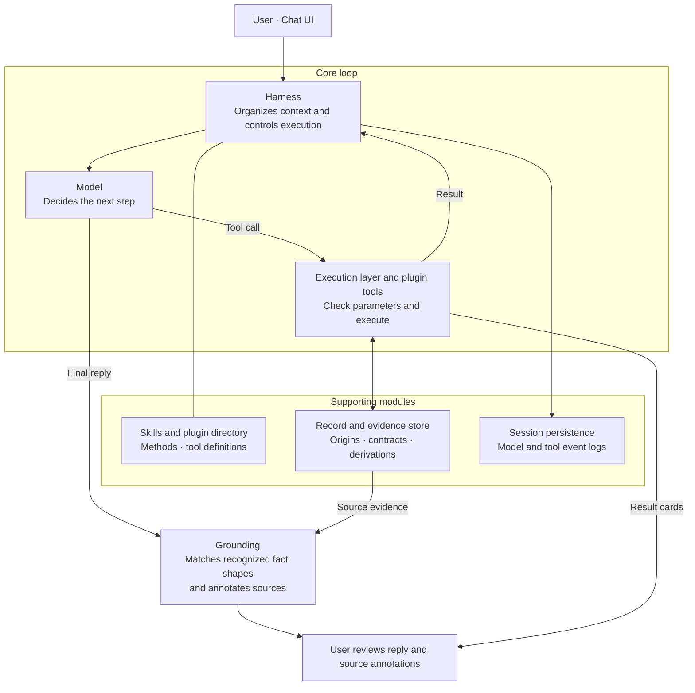

# Cite Counsel Harness

An experimental agent harness for legal work. It keeps materials, model decisions, tool calls and source provenance together for review.

Legal research requires the right authority and a careful reading of the relevant passage. The reader needs to know which facts were supplied, which came from retrieved evidence, and what still needs checking. Cite Counsel gives the model a shared execution loop and a session evidence store. The model chooses how to investigate and draft. The harness checks tool access, parameters and provenance, and keeps the exchanges that led to the answer.

The harness stores source identity and document context so readers can review how material was used. They still have to judge jurisdiction, version, authority and whether a passage supports its use in context. Keeping the material and its origins makes those decisions open to inspection; it cannot guarantee they are correct.

> Experimental research aid. Review the original sources, the applicable law and the official McGill Guide before relying on an output. Grounding means traceability here; it does not establish legal correctness.

## Harness architecture



The model requests actions; the harness checks access and parameters, then executes them. Tool results return to the shared loop. The harness checks the final reply with grounding before displaying it, and sends structured result cards to the UI through the local API.

The model can read a Markdown Skill for a method, request an enabled plugin to load its tool schemas, or choose a tool call or reply. Reading a Skill does not execute a tool. An enabled plugin is available for the model to select and runs only when called.

The harness validates calls and stores results by reference (`rec_N`, `art_N`, and findings). Tools read the stored objects, so the model does not have to repeat their metadata. Summaries enter the conversation and structured blocks appear as UI cards. The model can keep investigating after a tool produces an artifact.

Code handles McGill formatting with local templates. Tools also compare quotations, build bibliographies and calculate dates. Source verification comes from stored derivations and is checked separately from formatting.

The researcher can inspect retrieved material and review the interpretation before deciding to rely on an authority. Code handles the repeatable operations in that work.

### Execution and extension contracts

The streamed and non-streamed interfaces use the same turn generator. `Result.content` sends references and summaries to model history; `Result.blocks` carries UI output. A turn allows at most 20 counted tool rounds. Rounds that only load plugins do not count toward that limit, but total iterations are still bounded. The model can continue after an artifact is produced.

Each plugin tool declares a Pydantic parameter model and a `handler(ctx, params) -> Result`. `Context` provides records for the session, plugin state and settings. `ctx.records.get(ref)` reads a stored object. `ctx.save(obj, meta)` checks the plugin category and audits derivations before saving it. Category violations or malformed derivations raise `ContractError`. Unsupported provenance claims in a derivation are downgraded to `model`, so they cannot retain verified status.

| Plugin category | Stored output contract | Implemented examples |
| --- | --- | --- |
| `source` | Records with database-origin fields; source identity is required for database verification | A2AJ, LEGISinfo, Crossref, Open Library |
| `extract` | Records with extracted-origin fields | File and web extraction |
| `function` | Artifacts and Findings with audited derivation chains | McGill, quotation checks, bibliography, deadlines |

`Field` holds a value and its origin. `Record` identifies a source and its fields; `Artifact` and `Finding` keep a `Derivation` of their inputs. With `record__read(ref, field, offset, limit)`, the model can read longer material in slices of up to 4,000 characters per call.

### What the checks mean

| Check | Implemented meaning | What it does not establish |
| --- | --- | --- |
| Database provenance | A source plugin supplies fields with `database` origin and a `source_id`; function outputs are reconciled against stored evidence | That the database hit is the intended work, authoritative, current or legally applicable |
| Citation `verified` status | Every leaf used in the citation's derivation must be database-backed and carry a source identity | Full McGill compliance or correctness of the legal proposition |
| Citation `format_checked` | The citation was rendered using the local rules and templates | Independent validation against every rule in the official Guide |
| Reply traceability | Recognized patterns such as years, case citations, DOIs and pinpoints are matched against non-model record fields and user messages; misses are marked `unsourced` | Coverage of every factual claim, entailment, source authority or sound legal reasoning |

Fields carry five origins: `database` for database-returned values, `extracted` for material read from files or pages, `user` for checked user input, `computed` for code-derived values with derivations, and `model` for unsupported model-supplied values. A database leaf must carry a `source_id` and match a complete stored value with that identity; a passage match alone cannot acquire database verification. Computed inputs are followed recursively to their leaves. Citation status is unverified if any leaf is extracted, user-supplied or model-supplied, even when the output is useful.

`record__compose` checks proposed field values and supporting quotes against stored sources or user input. Unsupported values remain labelled `model`; invalid field shapes are rejected. Copying a passage from database full text yields extracted material, and mixing source identities does not preserve database verification. Function plugins cannot gain verified status merely by asserting a database origin.

The contracts audit outputs from trusted plugins. Installed plugins run Python code without a sandbox and remain part of the trust boundary.

### Records, history and source snapshots

Sessions are stored locally under `.chatbox-runtime/sessions/`. Each has an atomic JSON snapshot, an append-only model/tool event log, attachments and saved web responses. The log records requests and responses for inspection. It does not provide deterministic replay or external tamper proofing.

The backend can restore an unexpired session after a service restart using its ID and token. Record references remain valid. The UI currently starts a fresh chat on page load and attempts to delete the previous session, so it does not restore visible chat history. The server stores only the token hash. Sessions expire after four hours idle; startup cleanup removes expired files and caps the number retained. New chat deletes the previous session and its stored materials. There is no chat archive.

Successful web fetches save response bytes, retrieval metadata and a hash. The UI can open those saved responses through session-authorized source links. Raw-response snapshots are not yet connected for the other source plugins. Retrieval time does not establish a statute's version date.

## A plugin example: McGill citation

The McGill plugin uses source records and deterministic templates in [mcgill_rules.json](mcgill_rules.json) to render citations. It checks for missing fields and stores the fields used in each citation artifact's derivation. The quote plugin can supply a pinpoint tied to the cited work, and the bibliography plugin uses stored citations. Formatting is checked separately from source verification. The schemas and selected fixed statutory forms do not cover every McGill Guide rule or establish legal applicability.

In the chat UI, users can supply an authority or upload material and ask the model to review a passage with its sources. The model selects from the available tools. Any findings, cards and annotations produced during the session accompany the answer. This is an example of intended use; it is not a recorded demo, and lookups can fail.

## Quick start

Use Python 3.11+ in the project directory:

```powershell
python -m venv .venv
.\.venv\Scripts\python.exe -m pip install -r requirements.txt
.\.venv\Scripts\python.exe run_chatbox.py
```

Open <http://127.0.0.1:8001>. One Python process serves the page and API. Keep the terminal running; Ctrl+C stops it. The settings bar accepts a model ID and OpenRouter API key. The key is written to the project-root `.env`, takes effect immediately and is not displayed again.

- Copy [config/chatbox.example.json](config/chatbox.example.json) to `config/chatbox.local.json` to configure the port, model, vision model, upload limit (50 MB by default) and daily spend estimate. Keep secrets in `.env`; see [.env.example](.env.example).
- Enable optional plugins and adjust their settings in the settings bar. Web search offers Exa or DuckDuckGo Lite; Exa requires `EXA_API_KEY`. A key entered in settings takes precedence over `.env`.
- `./start-chatbox.ps1` is an alternative launcher. With `-Restart`, it stops only a process whose command line matches this project's `run_chatbox.py`.

### Included plugins

Defaults below apply before saved user settings.

| Plugin | Category | Default | Capability |
| --- | --- | --- | --- |
| [`a2aj`](https://law.a2aj.ca/) | source | on | Find Canadian cases and legislation; retrieve case full text |
| [`legisinfo`](https://www.parl.ca/legisinfo/en/) | source | on | Find Canadian federal bills through LEGISinfo |
| [`crossref`](https://www.crossref.org/documentation/retrieve-metadata/rest-api/) | source | on | Retrieve article metadata by DOI or title |
| [`openlibrary`](https://openlibrary.org/developers/api) | source | on | Retrieve book metadata by ISBN or title |
| `file` | extract | on | Extract uploaded PDF, DOCX, PPTX, XLSX and image content |
| `web` | extract | off | Search and fetch public pages with SSRF protection |
| `mcgill` | function | on | Render citations and report missing fields |
| `quote` | function | on | Compare quotations with stored database judgment text |
| `bibliography` | function | on | Build a bibliography from stored citations |
| `deadlines` | function | off | Compute dates from explicit inputs; does not select the governing legal rule |

Source plugins produce database-origin records; extract plugins produce extracted-origin records; function plugins produce artifacts and findings whose derivations are audited. Metadata can be incomplete and external services can fail.

### Privacy and operational limits

- The server listens on `127.0.0.1` and uses TrustedHost and same-origin checks, rate limiting, CSP, and upload extension, size and header checks.
- With a configured key, conversation content is sent to OpenRouter and its model providers. Plugins contact external databases and websites. Do not submit material that must not leave your machine.
- Session files, event logs, attachments and web snapshots retain sensitive content locally until cleanup or deletion. Local persistence is not an encrypted document repository.
- `daily_spend_cap_usd` is an in-process estimate that resets on restart, not a hard billing limit. Set a limit on the OpenRouter key for strict billing control.
- Source matching and legal interpretation remain review tasks. There is no automatic guarantee of current law, comprehensive research or a correct legal conclusion.

## Development and design

[HARNESS.md](docs/HARNESS.md) describes the running architecture, contracts, persistence and grounding. [LEGAL_TOOL_PLATFORM_BLUEPRINT.md](docs/LEGAL_TOOL_PLATFORM_BLUEPRINT.md) records the broader design specification; consult the code and HARNESS.md for implemented behavior.

| Location | Responsibility |
| --- | --- |
| `harness/core.py` | Shared streamed loop, tool execution and built-in record tools |
| `harness/plugin.py`, `harness/skills.py`, `skills/` | `Plugin`, `Tool`, `Result`, `Setting`, `UserText`; discovery and optional methods |
| `harness/records.py`, `core/tool_contracts.py` | Numbered evidence, leaf reconciliation; `Field`, `Record`, `Artifact`, `Finding`, `Derivation` |
| `harness/session.py`, `harness/grounding.py` | Persistence, event logs, source snapshots and reply annotations |
| `harness/app.py`, `harness/rate_limiter.py`, `harness/web/` | Local HTTP API, upload and request checks, settings and chat UI |
| `harness/llm.py` | Streaming, OpenRouter-compatible calls and model response profiles |
| `plugins/`, `local_tools/` | Tool plugins and database, web and file adapters |
| `core/`, `mcgill_rules.json` | Deterministic formatting, bibliography, quote checks and supporting logic |

A plugin exports `PLUGIN` from `plugins/<name>/__init__.py` or the `citecounsel.plugins` entry point. The interface has separate declarations for callable tools, optional methods and presentation:

| Declaration | Responsibility |
| --- | --- |
| `tools` | Typed model-callable operations with parameter schemas and handlers |
| `category` | The output provenance contract: source, extract or function |
| `actions` | Deterministic UI-button operations without a model call |
| `ui` / `settings` | Optional plugin rendering and configuration |
| `fact_patterns` | Domain patterns used by reply traceability checks |

`UserText` marks parameters that should contain the user's words. The harness checks them against user messages before execution; a model argument alone cannot establish user provenance. Skills load as optional Markdown methods separately from tool schemas. Plugins are discovered at startup and do not hot reload. See [HARNESS.md](docs/HARNESS.md) for the full contract and the remaining McGill-specific registration coupling in `record__compose`.

To run the tests, install the test dependencies in the same environment:

```powershell
.\.venv\Scripts\python.exe -m pip install pytest httpx
.\.venv\Scripts\python.exe -m pytest
```

Tests cover tool and plugin contracts, provenance, citation identity, extraction, reply annotations and persistence. Most external services are mocked; passing tests do not establish live API or model availability.

MCP integration and more detailed source review in the UI are future directions. Neither is claimed as a current capability.

## License and notices

This project does not include or replace the McGill Guide. The Guide is a separate, copyrighted publication and the authority for its own rules. The code is released under the [MIT License](LICENSE).
