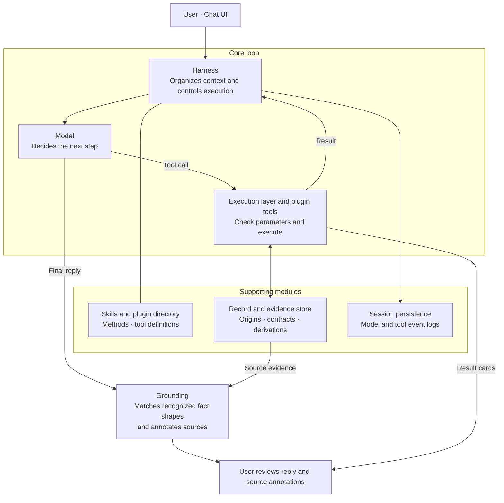

# Cite Counsel Harness

[](https://github.com/yubow47-bot/cite-counsel/actions/workflows/ci.yml)

[](LICENSE)

An agent harness for legal work. It checks each tool call against a schema, keeps each result tied to its source, and grounds the reply in those sources. Legal plugins designed for it, such as case law search and McGill citation, extend it into a harness for legal research.

## Harness architecture



1. The model decides each next step.
2. A shared loop checks each tool call against its schema before running it.
3. The result is saved with its source, and the model works from that saved record.
4. Before a reply is shown, the harness compares its citations, years, DOIs and pinpoints with the retrieved records, tool results and the user's messages. It shows where each one came from, or marks it as unsourced when it finds no match.

At each step the model can read a Skill (a short Markdown guide to a method), ask the harness to load an enabled plugin's tools, call a tool, or reply. Reading a Skill runs nothing, and an enabled plugin runs only when the model calls one of its tools.

Results are stored once and passed around by reference. Tools read the stored records directly, so the model doesn't have to copy their details into later calls. The model sees a short summary of each result, and the user sees it as a card in the chat. The model can keep investigating after a tool has produced something.

Plugins handle the repeatable work, such as formatting citations, comparing quotations, building bibliographies and counting dates. Whether a value is verified depends on the records it was built from, and that is checked separately from formatting. The researcher still reads the retrieved material and decides whether to rely on an authority.

## Example

Plugins run under the harness's rules. Here the Quote and McGill plugins run on a made-up judgment whose paragraph 2 reads *"The party seeking to uphold a limit must show it is demonstrably justified."*

```console
exact quotation        -> found, at para 2
lower-case "the"       -> case_differs (McGill requires exact quotations)
paraphrase             -> not_found
R v Oakes + reporter   -> *R v Oakes*, [1986] 1 SCR 103 at para 69.
R v Oakes only         -> refused: still needed: neutral or reporter citation
```

## Tools are plugins

Every tool is a plugin, and each plugin is one of three kinds. The kind sets what its output may claim as a source. If a plugin claims more, the harness downgrades the claim.

| Kind | What it does | Its output counts as |
| --- | --- | --- |
| Source | Looks up a database | Data from a named source |
| Extract | Reads a file or web page | Extracted text |
| Function | Formats, compares or calculates | Derived output with its inputs listed |

The current plugins cover legal and bibliographic databases, web search and page fetching, file extraction and McGill Guide citations. Other legal projects and methods can be added as new plugins.

| Plugin | Kind | What it does |
| --- | --- | --- |
| [A2AJ](https://law.a2aj.ca/) | source | Canadian cases and legislation |
| [LEGISinfo](https://www.parl.ca/legisinfo/en/) | source | Canadian federal bills |
| [Crossref](https://www.crossref.org/) | source | Journal articles by DOI or title |
| [Open Library](https://openlibrary.org/) | source | Books by ISBN or title |
| File | extract | Uploaded PDF, Word, PowerPoint, Excel and images |
| Web | extract | Public web pages |
| McGill | function | McGill Guide citations, with missing details listed |
| Quote | function | Checks quotations against judgment text |
| Bibliography | function | Bibliography from saved citations |
| Deadlines | function | Date calculations from given inputs |

## Quick start

You need an API key.

```bash
docker build -t cite-counsel .
docker run --rm -p 127.0.0.1:8001:8001 -e OPENROUTER_API_KEY=your-key cite-counsel
```

Or with Python:

```powershell
python -m venv .venv
.\.venv\Scripts\python.exe -m pip install -r requirements.txt
.\.venv\Scripts\python.exe run_chatbox.py
```

Open <http://127.0.0.1:8001> and enter the model and key in the settings bar.

## Privacy

Conversations are sent to the model provider, and plugins contact outside services. Chats are saved on your computer without encryption. Don't enter material that must stay on your machine.

## Development

[docs/HARNESS.md](docs/HARNESS.md) explains the design and [CONTRIBUTING.md](CONTRIBUTING.md) covers writing plugins.

403 automated tests cover tool contracts, source tracking, citations, extraction, reply grounding and saved sessions. CI runs them on Python 3.11 and 3.12. The default run is offline, with outside services mocked. Run them with `pip install pytest httpx` and `pytest`.

## License

[MIT](LICENSE). This project does not include or replace the McGill Guide, a separate copyrighted publication.
